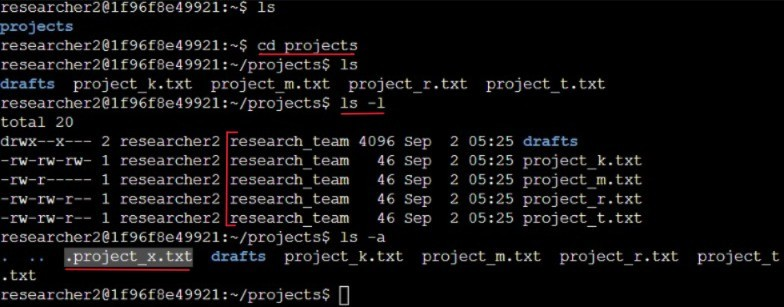
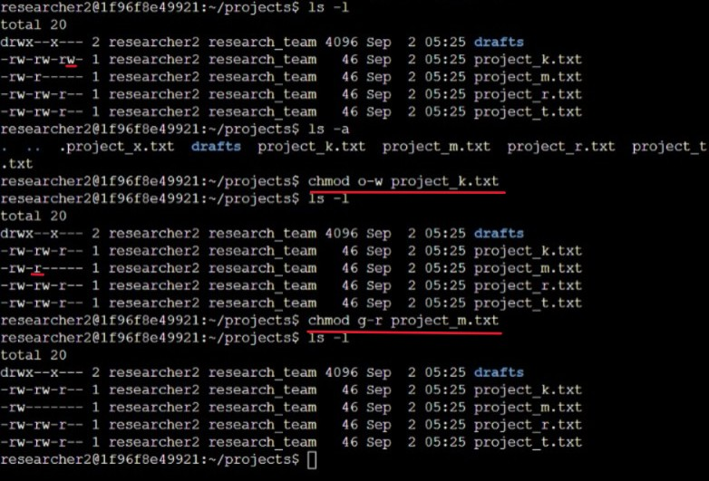
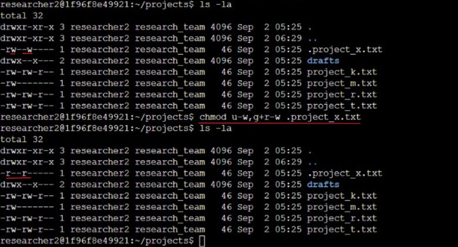
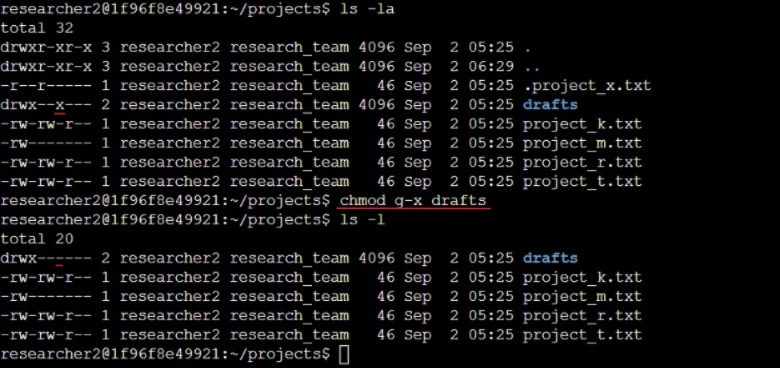

In this lab, I practiced using Linux commands to manage file and directory permissions. The goal was to check and adjust authorization settings in the `/home/researcher2/projects` directory, making sure only the right users and groups had access.

### Task 1: Check file and directory details
Navigated to the `projects` directory, listed all files with their permissions, and verified ownership.  
**Group owner of files:** `research_team`  
**Hidden file detected:** `.project_x.txt`  

---

### Task 2: Change file permissions
Checked for files allowing "other" users to write and corrected permissions. Also restricted group access on sensitive files.  
**Files fixed:** `project_k.txt` (removed write for others), `project_m.txt` (removed read for group).

---

### Task 3: Change permissions on a hidden file
Checked the hidden file `.project_x.txt`, removed write permissions for others, ensured the group could read it, and the user retained read access.

---

### Task 4: Change directory permissions
Updated the `drafts` directory permissions so only `researcher2` can access it, removing execute rights for the group.  

