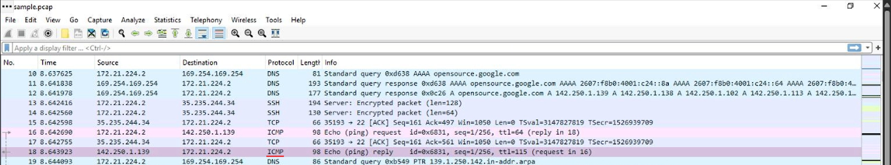
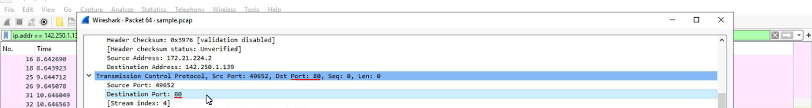
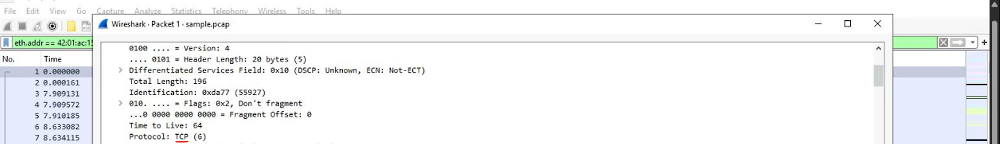
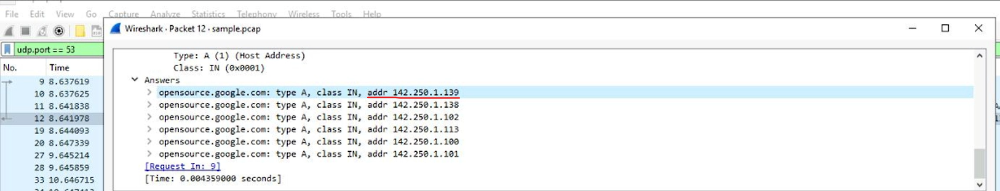
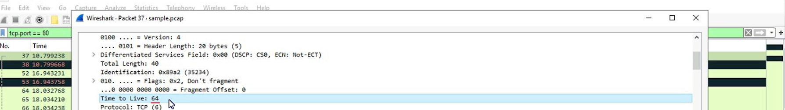
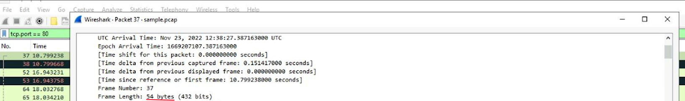
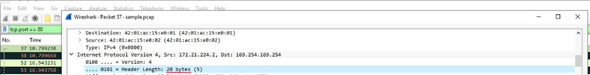
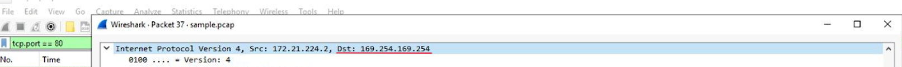

In this lab, I practiced using **Wireshark** to analyze network traffic. The activity focused on inspecting packet captures, applying filters, and identifying relevant details about network communications, such as source/destination IPs, protocols, and payload data.

### Task 1: Explore data with Wireshark
Opened the sample `.pcap` file in **Wireshark** to explore how captured network data is presented. Reviewed key columns such as **No., Time, Source, Destination, Protocol, Length, and Info**, and examined coloring rules for quick traffic identification.  

**Question:** What is the protocol of the first packet where the *Info* column starts with `"Echo (ping) request"`?  
**Answer:** `ICMP`  

### Task 2: Apply a basic Wireshark filter and inspect a packet
Applied a display filter `ip.addr == 142.250.1.139` to isolate traffic related to a specific IP address. The filtered view showed packets using **ICMP** and **TCP/HTTP** protocols. Opened the first TCP packet and inspected its details across multiple layers (**Frame**, **Ethernet II**, **IPv4**, and **TCP**). Verified source/destination IPs, ports, and TCP flags in the detailed view.  

**Question:** What is the TCP destination port of this TCP packet?  
**Answer:** `80`  

### Task 3: Use filters to select packets
Applied multiple filters in **Wireshark** to analyze packets by source IP, destination IP, and Ethernet MAC address:  
- Source filter: `ip.src == 142.250.1.139`  
- Destination filter: `ip.dst == 142.250.1.139`  
- MAC filter: `eth.addr == 42:01:ac:15:e0:02`  

Inspected the first packet from the MAC address filter and expanded the **IPv4** subtree to verify protocol details.  

**Question:** What is the protocol contained in the **IPv4** subtree from the first packet related to MAC address `42:01:ac:15:e0:02`?  
**Answer:** `TCP`  

### Task 4: Use filters to explore DNS packets
Applied the filter `udp.port == 53` in **Wireshark** to isolate DNS traffic.  
- Opened the first packet and inspected the **Domain Name System (query)** subtree, confirming the queried domain: `opensource.google.com`.  
- Opened the fourth packet and expanded the **Answers** section to verify the resolved IP address.  

**Question:** Which of these IP addresses is displayed in the expanded **Answers** section for the DNS query for `opensource.google.com`?  
**Answer:** `142.250.1.139`  

### Task 5: Use filters to explore TCP packets
Filtered TCP traffic on port 80 in **Wireshark** to isolate web traffic and inspected the first packet.

**Question 1:** Time to Live (TTL) value in **IPv4** subtree  
**Answer:** `64`  

**Question 2:** Frame Length as specified in **Frame** subtree  
**Answer:** `54 bytes`  

**Question 3:** Header Length in **IPv4** subtree  
**Answer:** `20 bytes`  

**Question 4:** Destination Address in **IPv4** subtree  
**Answer:** `169.254.169.254`  

