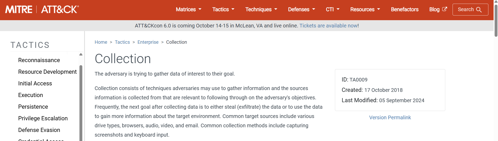

In this lab, I practiced **malware detection and threat simulation** using a purple-team approach. The scenario was based on **PicoSecure**, which initiated a detection engineering exercise after multiple incident response activities. Working alongside an external penetration tester, I analyzed malware behavior executed on a simulated internal workstation and configured security tools to detect and block malicious actions, following the **Pyramid of Pain** to prioritize adversary indicators.

---

### Sample 1: Hash Blocking
Scanned `sample1.exe` using the **Malware Sandbox** tool to inspect its behavior. After reviewing the report, I selected the **MD5 hash** of the file and blocked it in the **Manage Hashes** section.

  

---

### Sample 2: IP Blocking
After analyzing `sample2.exe`, the report showed suspicious network activity, including a single HTTP request and multiple TCP/UDP connections to the command-and-control server at IP `154.35.10.113` (Intrabuzz Hosting Limited).  

To block this malicious behavior, I created a firewall rule in the **Firewall Rule Manager** to deny all outbound connections to that IP. This successfully prevented the malware from communicating externally and mitigated the threat.

  

---

### Sample 3: Domain Blocking
After analyzing `sample3.exe`, the report indicated multiple HTTP requests, TCP/UDP connections, and DNS requests to the malicious domain `emudyn.bresonicz.info` (XplorIta Cloud Services).  

To prevent further communication, I created a **DNS filter rule** in the **DNS Rule Manager**, categorizing it as **Malware** and denying all queries to this domain. This successfully blocked the malware from connecting to its command-and-control server.

  

---

### Sample 4: Registry Modification Blocking
After analyzing `sample4.exe`, the report showed that the malware attempted to modify the Windows Registry to disable real-time protection in Windows Defender.  

To prevent this malicious behavior, I created a **Registry rule** to monitor and block unauthorized modifications to the key:

`HKEY_LOCAL_MACHINE\SOFTWARE\Microsoft\Windows Defender\Real-Time Protection`  
with the value `DisableRealtimeMonitoring = 1`.  

This successfully prevented the malware from altering the system and mitigated the threat.

**MITRE ATT&CK ID:** `T1562.001 – Impair Defenses: Disable or Modify Tools`  
**Tactic:** Defense Evasion (TA0005)

  
  

---

### Sample 5: Beaconing Detection
After analyzing `sample5.exe`, the report showed repeated HTTP requests and TCP/UDP connections to the malicious domain `bababa10la.cn` (XplorIta Cloud Services).  
The malware was sending small beaconing payloads every 30 minutes to maintain communication with its command-and-control server.  

To block this malicious behavior, I created a **Sigma network detection rule** in the **Network Rule Manager**, configured to detect connections with size 97 bytes occurring every 1800 seconds. This successfully prevented the malware from communicating with the C2 server and mitigated the threat.

  
  
  

---

### Sample 6: File Exfiltration Blocking
After analyzing `sample6.exe`, the report showed that the malware created a text file named `exfiltr8.log` in the `%temp%` directory, containing system and network information.  

To prevent this malicious behavior, I created a **File Creation/Modification rule** in the **File Rule Manager**, configured to monitor and block the creation or modification of any file named `exfiltr8.log` in the `%temp%` folder. This successfully prevented the malware from storing sensitive information locally and mitigated the threat.

**MITRE ATT&CK ID:** `T1005 – Data from Local System`  
**Tactic:** Collection (TA0009)

  
  
  

---

### Final Overview
The lab demonstrated how different **defense strategies** can be applied to detect, block, and mitigate malware behavior at various stages of the attack lifecycle. By progressing from simple indicators such as file hashes to more complex patterns like beaconing and exfiltration, I reinforced the principle of prioritizing detection at higher levels of the **Pyramid of Pain**.

